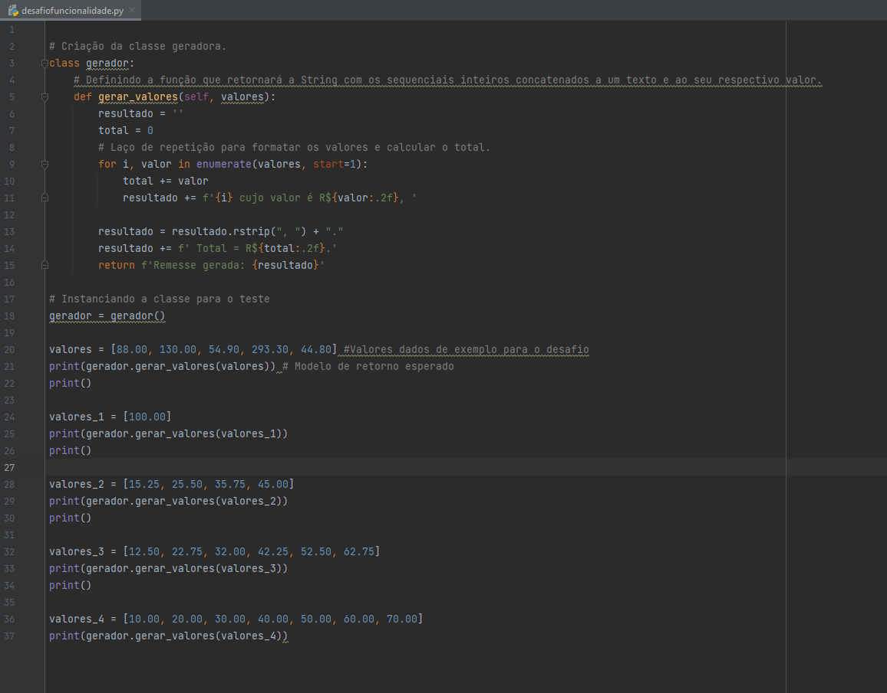
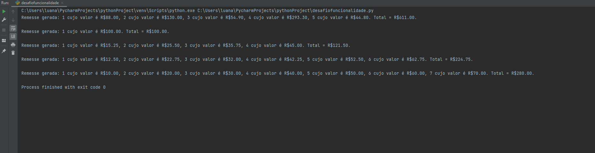

## 💻 Sistema de Geração de Sequência Numerada com Valores

⚙️ Neste projeto criamos uma funcionalidade onde o objetivo é criar uma sequência numerada onde cada número está associado a um valor monetário. Ao fim do programa, o código ainda calcula o total da soma desses valores.

Ao início, criamos uma classe "gerador", onde dentro dela é definida uma função "gerar_valores()", função esta que irá receber como parâmetro os valores que iremos tratar. No interior da função usamos um laço de repetição para percorrer os valores e referenciálos com seus índices, cada iteração gerando uma String para ser usada posteriormente. Por fim, as String sao concatenadas com a devida estrutura do modelo proposto pelo desafio e apresentando a soma dos valores ao final.

No decorrer do código nos deparamos com os valores usados como exemplo para demonstrar a funcionalidade do sistema.

⬇️ Abaixo um print do código com os valores fictícios usados para criar os testes. ⬇️

⬇️ Seu respectivo retorno ⬇️

